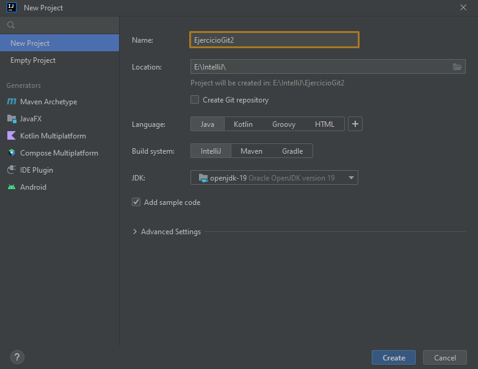

# ejercicioGit2

<!-- TODO: Ir completando cada punto con capturas y código -->

1. Creación de repositorio en GitHub, inicializándolo con un README.md y el .gitignore que GiHub ofrece para Java.
2. Modificación de este README.md desde GitHub para indicar lo dos primeros pasos.
3. Clono el repositorio
4. Creo un proyecto en ese directorio
5. ¡Ups! el proyecto se creó en una subcarpeta. Muevo su contenido al directorio raiz del repo.
6. Quiero volver al paso 3 para hacerlo bien. Hago un log

    ```sh
    a22luisdze@W10N-I9E01 MINGW64 /e/IntelliJ/EjercicioGit2 (main)
    $ git log --oneline
    ea376f4 (HEAD -> main, origin/main, origin/HEAD) Primer commit
    1ed5416 Update README.md
    ca83242 Initial commit
   ```

   Como quiero volver a antes de crear el proyecto, tengo que hacer un reset al commit previo (5ae4948). Al hacerlo, perdería los commits posteriores, así que creo una rama nueva para ello.

   ```bash
   a22luisdze@W10N-I9E01 MINGW64 /e/IntelliJ/EjercicioGit2 (main)
    $ git branch rama2

    a22luisdze@W10N-I9E01 MINGW64 /e/IntelliJ/EjercicioGit2 (main)
    $ git checkout rama2
    Switched to branch 'rama2'
   ```

(Para crear una rama y pasar directamente a ella se podría también hacer en un paso con "git checkout -b rama2").

Ahora ya puedo hacer el reset:
```bash
a22luisdze@W10N-I9E01 MINGW64 /e/IntelliJ/EjercicioGit2 (rama2)
$ git reset --hard 1ed5
HEAD is now at 1ed5416 Update README.md
   ```

y crear el proyecto directamente en el directorio donde ya está el repo.


